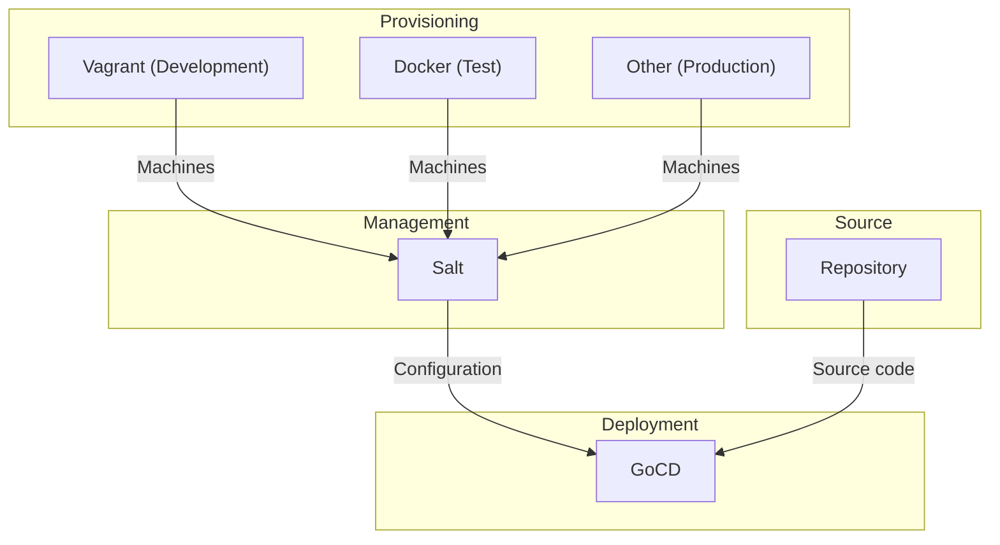

# Getting started

The tools you need to set up will differ based on the environment you want to set up. See the following diagram:

See the subchapters for detailed instructions on each of the different tools.

## [Local development environments](development.md)

In development environments machines are managed by Vagrant. The default environment provides the following machines:

* A Salt master to provision all of the machines
* An application server running nginx and PHP-FPM, preconfigured for remote debugging with Xdebug
* A database server running PostgreSQL
* A mail server running MailCatcher, allowing you to see outbound email in real-time
* A complete Selenium environment, consisting of a hub server, a Firefox node and a Chrome node.

The following machines are provided for testing production configurations:

* A GoCD instance for testing deployment pipelines
* A nameserver running BIND for testing your DNS configuration.

Machines can be started and stopped independently or by using Vagrant groups. You're also able to add your own machines as required.

## [Continuous integration and test environments](test.md)

In this configuration, all of the [roles](../roles/README.md) required for a bare bones testing environment are installed in a single container. Whilst not in the spirit of containers this was a necessary compromise to be compatible with current CI implementations. As soon as we're aware of Docker Compose or similar support in one of the CI platforms we'll rework this.

## [Production deployments](production.md)

Ubiquitous does not provide a provision tool configuration for production environments. Our manual installation instructions can be automated with your preferred tool.
