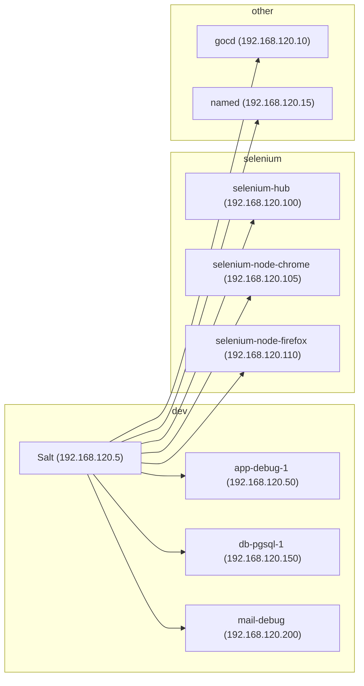

# Using Ubiquitous in development

In development environments, Ubiquitous servers are created and managed in VirtualBox by Vagrant based on definitions in the `Vagrantfile`. Once created, Vagrant's shell provisioner runs a script which installs the Salt master and minion daemons, seeds configuration and keys. Server configuration is managed by Salt.

A complete configuration with all machines started is configured like so:



## Getting started

First, prepare your development by installing the following applications:

* [VirtualBox](https://www.virtualbox.org/) --- desktop virtualisation
* [Vagrant](https://www.vagrantup.com/) --- command line tool for managing virtualised development environments.

Then install some Vagrant plugins that'll make it easier to manage larger environments:

```
# Manage virtual machines in groups
$ vagrant plugin install vagrant-group

# Automatically manage Guest Additions versions
$ vagrant plugin install vagrant-vbguest
```

You'll need to structure your Moodle development environment appropriately. Ubiquitous sets up a synced folder for `../Moodle` relative to itself to get your source code to the application server:

```
.
├── Moodle
└── Ubiquitous
```

For the single sign-on it will expect an additional folder `../SimpleSAMLphp` with the SimpleSAMLphp source code: 

```
.
└── SimpleSAMLphp
```


Start up all of the machines necessary for a testing environment:

```
$ vagrant group up dev
```

The first time you start the servers, and whenever you make changes to the Salt states, you'll need to apply the states to the machines:

```
# Provision the Salt master first, opening the ports necessary for
# master-minion configuration
$ vagrant ssh --command 'sudo salt salt state.apply'

# Then converge the rest of the machines
$ vagrant ssh --command "sudo salt -G 'group:dev' state.apply"
```

Make sure that your changes are being synced automatically with the salt master:

```
$ vagrant auto-sync salt
```

The above may take some time to complete. Once the above commands complete, the following services should now be available to you:

* [Moodle](http://192.168.120.50/) --- your development environment
* [Behat instance](http://192.168.120.50/behat/) --- your development environment's Behat `wwwroot`
* [Behat fail dump](http://192.168.120.50/data/behat-faildump/) --- screenshots and page snapshots for failing Behat tests
* [MailCatcher](http://192.168.120.200:1080/) --- a simple mail server that allows you to browse all of the email it receives
* PostgreSQL database at `192.168.120.150:5432` --- use an [open source tool](https://wiki.postgresql.org/wiki/Community_Guide_to_PostgreSQL_GUI_Tools#Open_Source_.2F_Free_Software) to connect to it.

## Recommended Moodle configuration

The following configuration ensures that complex parts of Ubiquitous such as the Behat testing environment function as expected.

```php
<?php // Moodle configuration file

// Boilerplate
unset($CFG);
global $CFG;
$CFG = new stdClass();

// Database server
    // MySQL
    //$CFG->dbtype    = 'mysqli';
    //$CFG->dblibrary = 'native';
    //$CFG->dbhost    = '192.168.120.155';
    //$CFG->dbname    = 'moodle';
    //$CFG->dbuser    = 'moodle';
    //$CFG->dbpass    = 'Password123';
    //$CFG->prefix    = 'mdl_';
    //$CFG->dboptions = array (
    //    'dbpersist' => 0,
    //    'dbport'    => 3306,
    //    'dbsocket'  => '',
    //);

    // PostgreSQL
    $CFG->dbtype    = 'pgsql';
    $CFG->dblibrary = 'native';
    $CFG->dbhost    = '192.168.120.150';
    $CFG->dbname    = 'ubuntu';
    $CFG->dbuser    = 'ubuntu';
    $CFG->dbpass    = 'gibberish';
    $CFG->prefix    = 'mdl_';
    $CFG->dboptions = array (
        'dbpersist' => 0,
        'dbport'    => 5432,
        'dbsocket'  => '',
    );

    // SQL Server
    //$CFG->dbtype    = 'sqlsrv';
    //$CFG->dblibrary = 'native';
    //$CFG->dbhost    = 'tcp:192.168.120.155';
    //$CFG->dbname    = 'moodle';
    //$CFG->dbuser    = 'moodle';
    //$CFG->dbpass    = 'Password123';
    //$CFG->prefix    = 'mdl_';
    //$CFG->dboptions = array(
    //    'dbpersist' => 0,
    //    'dbport'    => 1433,
    //    'dbsocket'  => '',
    //);

// Base URLs
$CFG->wwwroot = 'http://192.168.120.50';
$CFG->admin   = 'admin';

// Data directory
$CFG->dataroot             = '/home/ubuntu/data/base';
$CFG->directorypermissions = 0770;

// Send mails via MailCatcher on mail-debug
$CFG->smtphosts = '192.168.120.200:1025';

// Enable debugging
$CFG->debug        = E_ALL;
$CFG->debugdisplay = true;

// Common developer options
//$CFG->debugstringids = true;
//$CFG->langstringcache = false;
//$CFG->cachejs = false;
//$CFG->themedesignermode = true;

// Behat testing environment
$CFG->behat_prefix        = 'b_';
$CFG->behat_dataroot      = '/home/ubuntu/data/behat';
$CFG->behat_faildump_path = '/home/ubuntu/data/behat-faildump';
$CFG->behat_wwwroot       = 'http://localhost/behat';
$CFG->behat_profiles = array(
'chrome' => array(
    'extensions' => array(
        'Behat\MinkExtension' => array(
            'selenium2' => array(
                'browser' => 'chrome',
                'capabilities' => array(
                    'browser' => 'chrome',
                    'browserName' => 'chrome',
                ),
            ),
        ),
    ),
),
'firefox' => array(
    'extensions' => array(
        'Behat\MinkExtension' => array(
            'selenium2' => array(
                'browser' => 'firefox',
                'capabilities' => array(
                    'browser' => 'firefox',
                    'browserName' => 'firefox',
                ),
            ),
        ),
    ),
),
'iexplore' => array(
    'extensions' => array(
        'Behat\MinkExtension' => array(
            'selenium2' => array(
                'browser' => 'iexplore',
                'capabilities' => array(
                    'browser' => 'iexplore',
                    'browserName' => 'iexplore',
                ),
            ),
        ),
    ),
),
);
$CFG->behat_config = array_merge(array(
'default' => array(
    'extensions' => array(
        'Behat\MinkExtension' => array(
            'selenium2' => array(
                'wd_host' => 'http://localhost:4444/wd/hub',
                'capabilities' => array(
                    'browserVersion'    => 'ANY',
                    'deviceType'        => 'ANY',
                    'name'              => 'ANY',
                    'deviceOrientation' => 'ANY',
                    'ignoreZoomSetting' => 'ANY',
                    'version'           => 'ANY',
                    'platform'          => 'ANY',
                ),
            ),
        ),
    ),
),
), $CFG->behat_profiles);

// Selenium node path configuration
// Requires https://github.com/moodle/moodle/compare/master...LukeCarrier:MDL-NOBUG-selenium-remote-node-file-upload-master
$CFG->behat_node_dirroot = '/var/lib/selenium/moodle';
$CFG->behat_node_dir_sep = '/';

// PHPUnit testing environment
$CFG->phpunit_prefix   = 'phpu_';
$CFG->phpunit_dataroot = dirname($CFG->dataroot) . '/phpunit';

// Bootstrap Moodle
require_once __DIR__ . '/lib/setup.php';
```

## Running Moodle test suites

Moodle has three distinct environments for development:

* The development environment we interact with directly
* The Behat environment, which is a replica of the above with a different `wwwroot` and no content
* The PHPUnit environment, which is accessible only via the CLI.

### Behat

Ubiquitous packages a Selenium Grid comprised of Chrome and Firefox nodes. To use it, first bring up the Selenium grid:

```
# Start the servers
$ vagrant group up selenium

# If it's your first time, let Salt configure them
$ vagrant ssh salt --command "sudo salt -G 'group:selenium' state.apply"
```

Once complete, the following services will be available to you:

* [Selenium Grid console](http://192.168.120.100:4444/grid/console) --- see an overview of available nodes, helpful for diagnosing registration issues
* VNC for the Selenium Chrome node at `192.168.120.105:5999` --- use an [open-source tool](https://en.wikipedia.org/wiki/Comparison_of_remote_desktop_software) to connect to it
* VNC for the Selenium Firefox node at `192.168.120.110:5999`.

Then ensure that all of the Behat-related options are present in your Moodle `config.php` (see the recommended configuration for advice) and run the following command to bootstrap your test site:

```
$ vagrant ssh app-debug-1 --command 'php current/admin/tool/behat/cli/init.php'
```

The acceptance test site will then be accessible from each of the application servers at [`{wwwroot}/behat`](http://192.168.120.50/behat/).

Some of the tests attempt to upload files within the Moodle source tree to the application. We must therefore synchronise the Moodle source tree to the Selenium nodes and apply [a patch](https://github.com/moodle/moodle/compare/master...LukeCarrier:MDL-NOBUG-selenium-remote-node-file-upload-master) to Moodle to allow it to locate these files:

```
$ vagrant rsync selenium-node-chrome
$ vagrant rsync selenium-node-firefox
```

Run the tests with:

```
$ vagrant ssh app-debug-1 --command 'cd current && php admin/tool/behat/cli/run.php --profile=chrome'
```

Further detail on using Behat is available in our [`app-debug` role documentation](../roles/app/debug.md#behat).

### PHPUnit

With the relevant configuration options present in your Moodle `config.php`, run the following to enable PHPUnit:

```
$ vagrant ssh app-debug-1 --command 'php current/admin/tool/phpunit/cli/init.php'
```

You may then run tests as follows:

```
$ vagrant ssh app-debug-1 --command 'php current/vendor/bin/phpunit'
```

## Troubleshooting

### I can't access my VMs!

For reasons we've been unable to identify, VirtualBox sometimes fails to configure the host-only network adapter (usually named `vboxnet0`) used as the private network between the virtual machines. When this happens, the adapter will be shown as `state DOWN`:

```
$ ip addr show
[snip]
5: vboxnet0: <BROADCAST,MULTICAST> mtu 1500 qdisc noop state DOWN group default qlen 1000
    link/ether 0a:00:27:00:00:00 brd ff:ff:ff:ff:ff:ff
```

To rectify this, add a network configuration for the adapter and bring up the link:

```
$ sudo ip addr add 192.168.120.1/24 dev vboxnet0
$ sudo ip link set vboxnet0 up
```

## TypeError: 'bool' object is not iterable

Issues can occur when applying Salt states to minions when the versions between the master and minions differ (e.g. when machines are provisioned at different times or destroyed and rebuilt). To remedy, allow Vagrant to reprovision your Salt master and minions:

```
$ vagrant provision
```

See the [Salt troubleshooting documentation](../roles/salt.md#typeerror-bool-object-is-not-iterable) or further information.

## Advanced topics

### Adding your own virtual machines

It's sometimes useful to be able to spin up additional machines with different configurations, for instance when unit testing against multiple platforms. This is possible within Vagrant environment by creating a `Vagrantfile.local` file in the same directory as the `Vagrantfile`.

For instance, to add an additional Vagrant VM running SQL Server:

```ruby
config.vm.define "db-mssql-1" do |dbmssql1|
  dbmssql1.vm.box = "msabramo/mssqlserver2014express"

  dbmssql1.vm.network "private_network", ip: "192.168.120.160"
  dbmssql1.vm.hostname = "db-mssql-1.moodle"
end
```

### Network configuration

The default network configuration of the Vagrant configuration is below. Note that not all of the machines listed will be started for most configurations.

| IP address | Hostname | Server role |
| --- | --- | --- |
| `192.168.120.5` | `salt.moodle` | Salt master |
| `192.168.120.10` | `gocd.moodle` | GoCD server |
| `192.168.120.15` | `named.moodle` | BIND named server |
| `192.168.120.50` | `app-debug-1.moodle` | Application server (with debugging) |
| `192.168.120.100` | `selenium-hub.moodle` | Selenium grid hub |
| `192.168.120.105` | `selenium-node-chrome.moodle` | Selenium node (Chrome) |
| `192.168.120.110` | `selenium-node-firefox.moodle` | Selenium node (Firefox) |
| `192.168.120.150` | `db-pgsql-1.moodle` | PostgreSQL server |
| `192.168.120.200` | `mail-debug.moodle` | Mail catcher |
