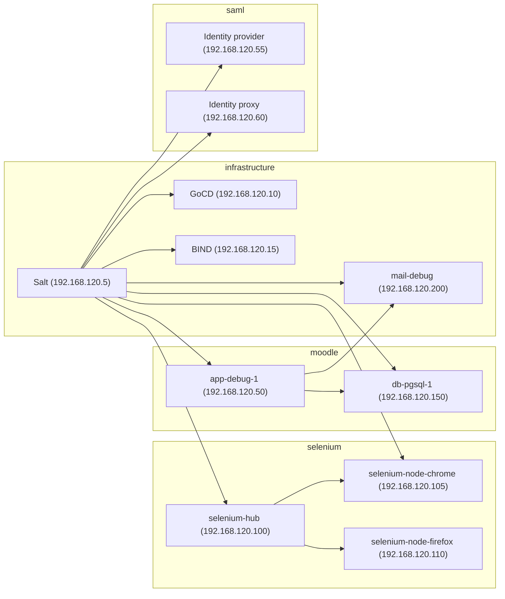

# Preparing a development environment

Before getting a development environment configured you'll need to install some external dependencies.

Note that guides within this document are provided on a best-effort basis. If you're struggling to get started, please open [an issue](https://github.com/AVADOLearning/moodle-ubiquitous/issues).

## The end result

In development environments, Ubiquitous servers are created and managed in VirtualBox by Vagrant based on definitions in the `Vagrantfile`. Once created, Vagrant's shell provisioner runs a script which installs the Salt master and minion daemons, seeds configuration and keys. Server configuration is managed by Salt.

A complete configuration with all machines started is configured like so:



Note that you're _very likely_ to need to use all of the machines, and should start only those necessary for the task at hand.

## The general idea

First, prepare your development by installing the following applications:

* [VirtualBox](https://www.virtualbox.org/) --- desktop virtualisation
* [Vagrant](https://www.vagrantup.com/) --- command line tool for managing virtualised development environments.

Then install some Vagrant plugins that'll make it easier to manage larger environments:

```
# Manage virtual machines in groups
$ vagrant plugin install vagrant-group

# Easily transfer files between machines
$ vagrant plugin install vagrant-scp

# Automatically manage Guest Additions versions
$ vagrant plugin install vagrant-vbguest
```

### Linux

1. Install [VirtualBox](https://www.virtualbox.org/). We recommend using the Oracle-supplied packages rather than those provided by your distribution.
2. Install [Vagrant](https://www.vagrantup.com/), using the appropriate package for your distribution and system architecture.
3. Install the [`vagrant-group`](https://github.com/vagrant-group/vagrant-group), [`vagrant-scp`](https://github.com/invernizzi/vagrant-scp) and [`vagrant-vbguest`](https://github.com/dotless-de/vagrant-vbguest) Vagrant plugins.
4. Increase the `inotify` watch limit to ensure your editor, IDE and `vagrant rsync-auto` processes don't exhaust the number of watchers:

   ```
   echo fs.inotify.max_user_watches=524288 | sudo tee /etc/sysctl.d/40-max-user-watches.conf && sudo sysctl --system
   ```

### macOS

1. Install [VirtualBox](https://www.virtualbox.org/). If the installation fails to complete [because a kernel extension wasn't trusted](https://developer.apple.com/library/content/technotes/tn2459/_index.html), approve the installation and re-run the installation package. It should complete successfully the second time.
2. Install [Vagrant](https://www.vagrantup.com/).
3. Install the [`vagrant-group`](https://github.com/vagrant-group/vagrant-group), [`vagrant-scp`](https://github.com/invernizzi/vagrant-scp) and [`vagrant-vbguest`](https://github.com/dotless-de/vagrant-vbguest) Vagrant plugins.

### Windows

1. Install [VirtualBox](https://www.virtualbox.org/).
2. Install [Vagrant](https://www.vagrantup.com/).
3. Install the [`vagrant-group`](https://github.com/vagrant-group/vagrant-group), [`vagrant-scp`](https://github.com/invernizzi/vagrant-scp) and [`vagrant-vbguest`](https://github.com/dotless-de/vagrant-vbguest) Vagrant plugins.

## Now what?

Once the above dependencies are installed you'll want to get some of the virtual machines running. There are two options here:

1. Prepare just the virtual machines you need (recommended). We have instructions for both [Moodle](moodle.md) and [SimpleSAMLphp](saml.md) and are working to complete documentation for the infrastructure components.
2. Go all in and prepare all of them, because a few months from now you might decide you want to start using them and not want to wait, right? To bring up and configure all of the machines one by one, run:

   ```
   $ ./_vagrant/init
   ```
