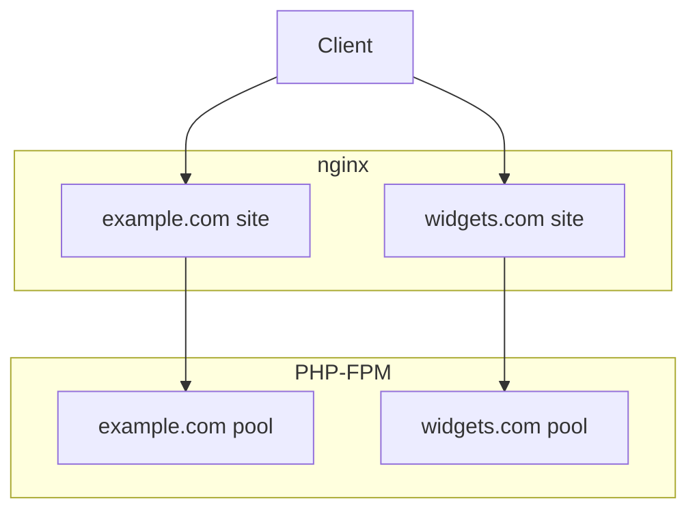

# Application servers

Application servers run an HTTP server ([nginx](https://nginx.org/) 1.10.x) and dispatch dynamic requests to [PHP-FPM](http://php.net/manual/en/install.fpm.php). They can host one or more platforms, each of which receives its own nginx `server {}` block and PHP-FPM `[pool]`.



## Home directories and filesystem ACLs

All source and data files for each platform are owned by separate user accounts, simplifying administration and providing a degree of isolation in the event that an application server is compromised. Whilst PHP-FPM pools and PHP worker processes will always run as these users, nginx (running as pillar `nginx:user`) needs read access to the document root to serve static files.

This role requires that all filesystems containing platform home directories (pillar `system:home_directories`) have support for Linux ACLs. You can verify that support is enabled as follows:

```
# Checking the active mount --- proceed to the defaults if they're enabled for
# the mount
$ mount | grep 'on / type'

# Checking defaults
# Pull requests for additional filesystems welcome ;-)
$ tune2fs /dev/xxx | grep 'Default mount options'    # ext* filesystems
```

## Platforms

A "platform" is an individual [Moodle](moodle.md) or [SimpleSAMLphp](saml.md) site, its corresponding local user account, nginx `server {}` block and its PHP-FPM `[pool]`. Individual application servers can serve multiple platforms. The list of platforms to be installed on each application server is determined based on the contents of the Salt pillar `platforms`, allowing variable allocation of platforms using the Salt top file and can be previewed as follows:

```
# For a list of the primary domains for each platform
$ sudo salt-call pillar.keys platforms

# To view a list of _all_ platform configuration
$ sudo salt-call pillar.keys platforms
```

Per-platform user accounts contain a directory structure like the following:

```
.
├── current     # Symlink to current release
└── releases    # Release directory
```

The nginx configuration follows the Debian convention, with per-platform configuration stored in `/etc/nginx/sites-available`. These configuration files are symlinked to `/etc/nginx/sites-enabled`, where nginx sources _enabled_ site configuration. Each platform will also source additional configuration from `/etc/nginx/sites-extra/<platform basename>.*.conf`.

The PHP-FPM configuration emulates this configuration. Configuration files are stored in `/etc/php/<version>/fpm/pools-available` and linked to `/etc/php/<version>/fpm/pools-enabled`. Each pool sources additional configuration from `/etc/php/<version>/fpm/pools-extra`.

This configuration facilitates blue/green deployments by simply adding links and reloading the appropriate service.

You can determine which platforms will be deployed to a given application server by querying the Salt pillar:

```
$ salt <minion ID> pillar.keys platforms
```

## Troubleshooting

### Locating access and error logs

Each platform receives its own dedicated log files:

* Access logs are written to `/var/log/nginx/<platform basename>/access.log`.
* Web server error logs (e.g. missing files, failed dynamic requests) are written to `/var/log/nginx/<platform basename>/error.log`.
* PHP errors are written to `/var/log/php<version>-fpm/<platform basename>/pool.log`, configured via the PHP `error_log`.

Requests to domains not associated with any platform will be be recorded in the "default" nginx access and error logs:
* `/var/log/nginx/access.log`
* `/var/log/nginx/error.log`

PHP-FPM service events and configuration issues are logged to the PHP-FPM log, located at `/var/log/php<version>-fpm/fpm.log`.

### 503 Gateway Timeout

A 503 is returned by nginx when an upstream (e.g. an HTTP server it's reverse proxying to, or a FastCGI server it's handing off a dynamic request to) fails to respond within the timeout. With Ubiquitous it usually indicates that a dynamic request being handled by PHP-FPM fails to respond within the [`fastcgi_read_timeout`](http://nginx.org/en/docs/http/ngx_http_fastcgi_module.html#fastcgi_read_timeout).

Either raise the read timeout or investigate the cause of the slow page load, e.g. by enabling Xdebug's [profiling](addons/debug.md#profiling) or tracing.

### 504 Bad Gateway

A 504 is returned by nginx isn't able to connect to an upstream. This usually indicates that an upstream either isn't listening (e.g. the service isn't running or has ceased responding to requests) or that it's listening at a different location.

First check that PHP-FPM is running -- visit `/status` at a platform's domain from a client that's allowed to view the diagnostic information (pillar key `php-fpm:status_clients`) or from a shell session:

```
$ curl -iv -H 'Host: example.com' http://localhost/status
```

If this fails, skip nginx and request the status from PHP-FPM:

```
$ sudo -u www-data \
        REQUEST_METHOD=GET \
        SCRIPT_NAME=/status \
        SCRIPT_FILENAME=/status \
        cgi-fcgi -bind -connect /var/run/php/php<version>-fpm-vagrant.sock
```
